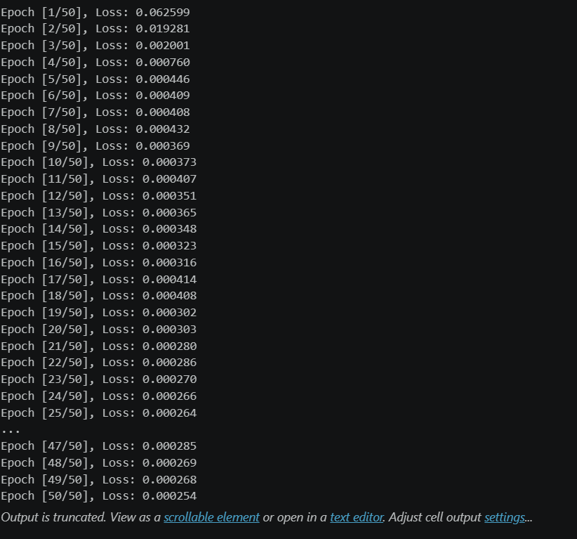
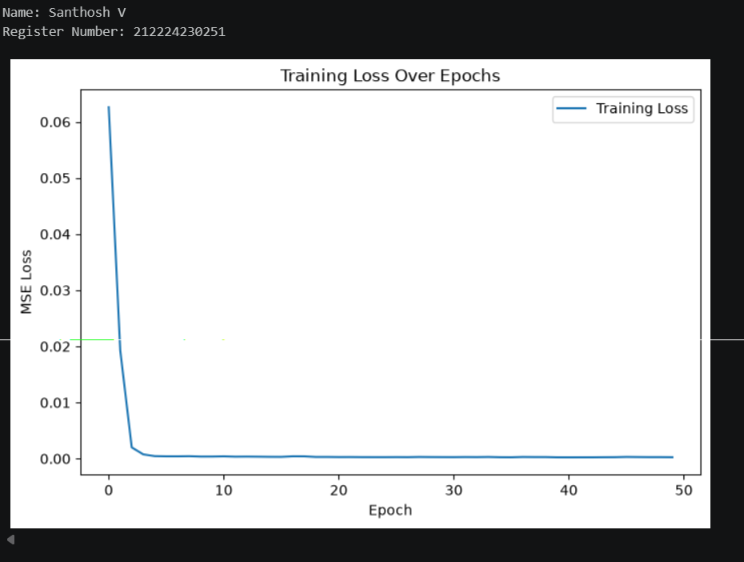
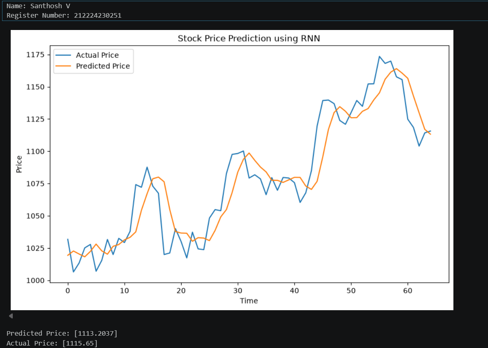
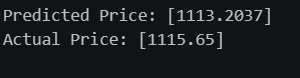

# DL- Developing a Recurrent Neural Network Model for Stock Prediction

## AIM
To develop a Recurrent Neural Network (RNN) model for predicting stock prices using historical closing price data.

## Problem Statement and Dataset


## DESIGN STEPS
### STEP 1: 

Load and preprocess the stock price dataset. Read the training and testing CSV files and extract the Close price column.

### STEP 2: 

Normalize the stock prices. Apply Min-Max Scaling to convert the closing prices into a range between 0 and 1.


### STEP 3: 

Create time-series sequences. Create sequences of 60 previous closing prices to predict the next closing price.


### STEP 4: 

Convert the data into PyTorch tensors. Create TensorDataset and DataLoader for training the RNN model.


### STEP 5: 

Build and train the RNN model. Create an RNN with hidden layers and a fully connected output layer. Use MSE Loss and Adam optimizer for training.

### STEP 6: 

Evaluate and visualize the predictions. Predict stock prices using the test data, convert the normalized values back to original prices, and compare actual and predicted prices using graphs.


## PROGRAM

### Name: Santhosh V

### Register Number: 212224230251

```python
# Define RNN Model
class RNNModel(nn.Module):

    def __init__(self, input_size=1, hidden_size=50,
                 num_layers=2, output_size=1):
        super(RNNModel, self).__init__()

        self.rnn = nn.RNN(
            input_size,
            hidden_size,
            num_layers,
            batch_first=True
        )

        self.fc = nn.Linear(
            hidden_size,
            output_size
        )

    def forward(self, x):
        out, hidden = self.rnn(x)
        out = out[:, -1, :]
        out = self.fc(out)

        return out

# Train the Model

num_epochs = 50
train_losses = []

for epoch in range(num_epochs):

    model.train()
    running_loss = 0.0

    for batch_x, batch_y in train_loader:

        batch_x = batch_x.to(device)
        batch_y = batch_y.to(device)

        optimizer.zero_grad()

        outputs = model(batch_x)

        loss = criterion(outputs, batch_y)

        loss.backward()

        optimizer.step()

        running_loss += loss.item()

    epoch_loss = running_loss / len(train_loader)

    train_losses.append(epoch_loss)

    print(
        f"Epoch [{epoch+1}/{num_epochs}], "
        f"Loss: {epoch_loss:.6f}"
    )

```

### OUTPUT

## Training Loss Over Epochs Plot




## True Stock Price, Predicted Stock Price vs time


### Predictions



## RESULT
## RESULT

Thus, the RNN model was successfully developed and used to predict stock prices from historical data.

